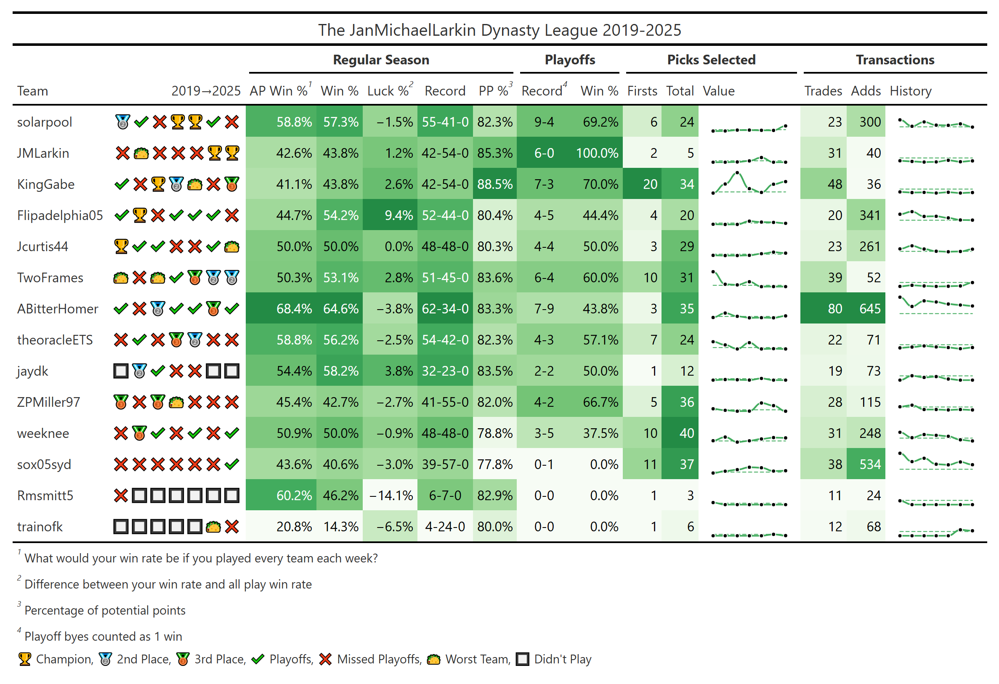

# ffhistorian

## Overview

`ffhistorian` is an R package that retrieves and visualizes fantasy football league history data. Built on top of the excellent [ffscrapr](https://github.com/ffverse/ffscrapr) package, it provides tools to analyze league performance across seasons, track user statistics, and create insightful visualizations of your fantasy football league's history.

## Installation

You can install the development version of `ffhistorian` from GitHub:

``` r
# pak is recommended, see https://github.com/r-lib/pak
pak::pak("ffverse/ffhistorian")

# can also use remotes
remotes::install_github("ffverse/ffhistorian")
```

## Getting Started

The main workflow involves three steps:

1.  **Connect to your league** using `ffscrapr`
2.  **Pull league history** with `ff_history()`
3.  **Analyze and visualize** the results

### Basic Example
```{r, message = FALSE, warning = FALSE}
library(ffhistorian)

conn <- ffscrapr::sleeper_connect(2025, "1248319500349087744")
history <- ff_history(conn)
```
```{r, eval = TRUE, echo = FALSE, message = FALSE}
# Save summary table as image
summary_table <- summary(history)
gt::gtsave(summary_table, "man/figures/summary_example.png")
```
```{r, echo = FALSE, out.width = "100%"}

```

### Supported Platforms

`ffhistorian` supports all platforms available through `ffscrapr`:

-   **Sleeper**
-   **ESPN** (requires authentication)
-   **MFL (MyFantasyLeague)**
-   **Fleaflicker**

#### ESPN Example

ESPN leagues require authentication via `espn_s2` and `swid` cookies:

``` r
# Store credentials as environment variables (recommended)
conn <- ffscrapr::espn_connect(
  season = 2025,
  league_id = "your_league_id",
  espn_s2 = Sys.getenv("ESPN_S2"),
  swid = Sys.getenv("SWID")
)

history <- ff_history(conn)
summary(history)
```

#### MFL Example

``` r
conn <- ffscrapr::mfl_connect(2025, league_id = "12345")
history <- ff_history(conn)
summary(history)
```

### Support

The best places to get help on this package are:

-   the [nflverse discord](https://discord.com/invite/5Er2FBnnQa) (for both this package as well as anything R/NFL related)
-   opening [an issue](https://github.com/ffverse/ffhistorian/issues/new/choose)

### Terms of Use

The R code for this package is released as open source under the [MIT license](https://ffscrapr.ffverse.com/LICENSE.html).

The APIs and data accessed by this package belong to their respective owners, and are governed by their terms of use.
